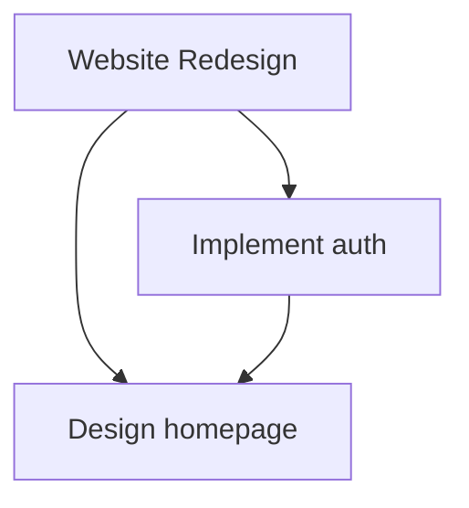

# CLI Reference: Mujarrad Command-Line Tools

The Mujarrad CLI provides commands for authentication, space management, and SDK operations.

## Installation

Install the Mujarrad CLI globally:

```bash
npm install -g @mujarrad/cli
```

Or use it locally in your project:

```bash
npm install --save-dev @mujarrad/cli
```

## Quick Start

```bash
# Authenticate
mujarrad auth login

# List spaces
mujarrad spaces list

# Create a new space
mujarrad spaces create my-workspace

# Initialize SDK in current project
mujarrad sdk init

# Generate API keys
mujarrad sdk keygen
```

## Authentication Commands

### `mujarrad auth login`

Authenticate with Mujarrad API using your credentials.

```bash
mujarrad auth login
```

**Prompts:**
- Email
- Password

**What it does:**
1. Authenticates with Mujarrad API
2. Retrieves API keys
3. Saves credentials to `~/.mujarrad/config.json`

**Example:**
```bash
$ mujarrad auth login
? Email: your@email.com
? Password: ********
✓ Authentication successful!
✓ API keys saved to ~/.mujarrad/config.json
```

### `mujarrad auth logout`

Clear saved authentication credentials.

```bash
mujarrad auth logout
```

**What it does:**
1. Removes credentials from `~/.mujarrad/config.json`
2. Clears cached API keys

**Example:**
```bash
$ mujarrad auth logout
✓ Logged out successfully
```

### `mujarrad auth status`

Check current authentication status.

```bash
mujarrad auth status
```

**Output:**
```bash
✓ Authenticated as: your@email.com
✓ API Public Key: pk_live_abc123...
✓ Default Space: my-workspace
```

## Space Commands

### `mujarrad spaces list`

List all spaces in your account.

```bash
mujarrad spaces list
```

**Output:**
```bash
Spaces:
  • my-workspace (ID: abc-123)
  • task-manager-demo (ID: def-456)
  • production (ID: ghi-789)

Total: 3 spaces
```

### `mujarrad spaces create <name>`

Create a new space.

```bash
mujarrad spaces create my-workspace
```

**Arguments:**
- `name` (required): Space name

**Options:**
- `--slug <slug>`: Custom slug (default: auto-generated from name)

**Example:**
```bash
$ mujarrad spaces create "My Workspace" --slug my-workspace
✓ Space created successfully!
  Name: My Workspace
  Slug: my-workspace
  ID: abc-123
```

### `mujarrad spaces switch <slug>`

Switch default space for CLI commands.

```bash
mujarrad spaces switch my-workspace
```

**Arguments:**
- `slug` (required): Space slug

**Example:**
```bash
$ mujarrad spaces switch production
✓ Switched to space: production
```

### `mujarrad spaces info <slug>`

Get detailed information about a space.

```bash
mujarrad spaces info my-workspace
```

**Output:**
```bash
Space Information:
  Name: My Workspace
  Slug: my-workspace
  ID: abc-123
  Created: 2026-01-15T10:30:00Z
  Updated: 2026-02-14T15:45:00Z

  Nodes: 127
  Relationships: 342
```

### `mujarrad spaces delete <slug>`

Delete a space (with confirmation).

```bash
mujarrad spaces delete my-workspace
```

**Arguments:**
- `slug` (required): Space slug

**Options:**
- `--force`: Skip confirmation prompt

**Example:**
```bash
$ mujarrad spaces delete my-workspace
? Are you sure you want to delete space "my-workspace"? (y/N) y
✓ Space deleted successfully
```

## Node Commands

### `mujarrad nodes list`

List all nodes in the current space.

```bash
mujarrad nodes list
```

**Options:**
- `--type <type>`: Filter by node type (REGULAR, CONTEXT, TEMPLATE)
- `--limit <n>`: Limit results (default: 100)
- `--space <slug>`: Override default space

**Example:**
```bash
$ mujarrad nodes list --type CONTEXT
Nodes (CONTEXT):
  • Alice Johnson (ID: user-123)
  • Bob Smith (ID: user-456)
  • Engineering Team (ID: team-789)

Total: 3 nodes
```

### `mujarrad nodes get <id>`

Get details of a specific node.

```bash
mujarrad nodes get node-id-123
```

**Arguments:**
- `id` (required): Node ID

**Output:**
```bash
Node Details:
  ID: node-id-123
  Title: Build authentication
  Type: REGULAR
  Slug: build-authentication
  Created: 2026-02-10T09:15:00Z
  Updated: 2026-02-14T14:30:00Z

  Details:
  {
    "status": "in_progress",
    "priority": "critical",
    "estimatedHours": 16,
    "tags": ["backend", "auth"]
  }
```

### `mujarrad nodes create`

Create a new node (interactive).

```bash
mujarrad nodes create
```

**Prompts:**
- Title
- Node type (REGULAR, CONTEXT, TEMPLATE)
- Node details (JSON)

**Example:**
```bash
$ mujarrad nodes create
? Title: Build login page
? Node Type: REGULAR
? Node Details (JSON): {"status": "todo", "priority": "high"}
✓ Node created successfully!
  ID: node-xyz-789
  Title: Build login page
```

### `mujarrad nodes update <id>`

Update a node.

```bash
mujarrad nodes update node-id-123 --details '{"status": "done"}'
```

**Arguments:**
- `id` (required): Node ID

**Options:**
- `--title <title>`: Update title
- `--details <json>`: Update node details (JSON string)

**Example:**
```bash
$ mujarrad nodes update node-id-123 --details '{"status": "done"}'
✓ Node updated successfully!
```

### `mujarrad nodes delete <id>`

Delete a node.

```bash
mujarrad nodes delete node-id-123
```

**Arguments:**
- `id` (required): Node ID

**Options:**
- `--force`: Skip confirmation

**Example:**
```bash
$ mujarrad nodes delete node-id-123
? Are you sure? (y/N) y
✓ Node deleted successfully
```

## Relationship Commands

### `mujarrad relationships create`

Create a relationship between two nodes.

```bash
mujarrad relationships create --source <source-id> --target <target-id> --verb <verb>
```

**Options:**
- `--source <id>`: Source node ID (required)
- `--target <id>`: Target node ID (required)
- `--verb <verb>`: Relationship verb (required)
- `--metadata <json>`: Optional metadata

**Example:**
```bash
$ mujarrad relationships create \
  --source project-123 \
  --target task-456 \
  --verb contains
✓ Relationship created successfully!
  ID: rel-789
  Source: project-123
  Target: task-456
  Verb: contains
```

### `mujarrad relationships list <node-id>`

List all relationships for a node.

```bash
mujarrad relationships list node-id-123
```

**Output:**
```bash
Relationships for node-id-123:
  Outgoing:
    • contains → task-456
    • contains → task-789
  Incoming:
    • owned_by ← user-123

Total: 3 relationships
```

## SDK Commands

### `mujarrad sdk init`

Initialize SDK in the current project.

```bash
mujarrad sdk init
```

**What it does:**
1. Creates `.env` file with API keys
2. Creates `src/client.ts` with Mujarrad client
3. Creates `package.json` (if missing)
4. Installs dependencies

**Example:**
```bash
$ mujarrad sdk init
? Space slug: my-workspace
✓ Created .env file
✓ Created src/client.ts
✓ Installing dependencies...
✓ SDK initialized successfully!

Next steps:
  1. npm run dev
  2. Edit src/index.ts to start building
```

### `mujarrad sdk keygen`

Generate new API keys.

```bash
mujarrad sdk keygen
```

**What it does:**
1. Generates a new API key pair
2. Displays keys (SAVE THEM!)
3. Optionally saves to `.env`

**Example:**
```bash
$ mujarrad sdk keygen
✓ API keys generated successfully!

Public Key: pk_live_abc123xyz...
Secret Key: sk_live_def456uvw...

⚠️  IMPORTANT: Save your secret key now. You won't be able to see it again!

? Save to .env file? (Y/n) y
✓ Saved to .env
```

### `mujarrad sdk config`

View or update SDK configuration.

```bash
mujarrad sdk config
```

**Output:**
```bash
SDK Configuration:
  API Public Key: pk_live_abc123...
  Space: my-workspace
  Config file: ~/.mujarrad/config.json

? Update configuration? (y/N)
```

## Graph Commands

### `mujarrad graph ancestors <node-id>`

Get all ancestors of a node.

```bash
mujarrad graph ancestors task-123
```

**Output:**
```bash
Ancestors of task-123:
  • project-456 (REGULAR) - Website Redesign
  • milestone-789 (REGULAR) - Phase 1: Design
  • user-012 (CONTEXT) - Alice Johnson

Total: 3 ancestors
```

### `mujarrad graph descendants <node-id>`

Get all descendants of a node.

```bash
mujarrad graph descendants project-123
```

**Output:**
```bash
Descendants of project-123:
  • task-456 (REGULAR) - Design homepage
  • task-789 (REGULAR) - Implement auth
  • task-012 (REGULAR) - Write tests

Total: 3 descendants
```

### `mujarrad graph visualize <node-id>`

Generate a graph visualization (ASCII art or mermaid).

```bash
mujarrad graph visualize project-123 --format mermaid
```

**Options:**
- `--format <format>`: Output format (ascii, mermaid, dot)
- `--depth <n>`: Traversal depth (default: 3)

**Output (mermaid):**


## Global Options

All commands support these global options:

| Option | Description |
|--------|-------------|
| `--space <slug>` | Override default space |
| `--api-key <key>` | Override API public key |
| `--api-secret <key>` | Override API secret key |
| `--format <format>` | Output format (json, table, yaml) |
| `--verbose` | Verbose output |
| `--quiet` | Suppress non-error output |
| `--help` | Show help |
| `--version` | Show version |

**Example:**
```bash
mujarrad nodes list --space production --format json --verbose
```

## Configuration Files

### `~/.mujarrad/config.json`

Global CLI configuration:

```json
{
  "apiPublicKey": "pk_live_abc123...",
  "apiSecretKey": "sk_live_def456...",
  "defaultSpace": "my-workspace",
  "lastLogin": "2026-02-14T10:30:00Z"
}
```

### `.env` (Project-specific)

Project environment variables:

```bash
MUJARRAD_API_PUBLIC_KEY=pk_live_abc123...
MUJARRAD_API_SECRET_KEY=sk_live_def456...
MUJARRAD_SPACE_SLUG=my-workspace
```

## Examples

### Complete Workflow

```bash
# 1. Authenticate
mujarrad auth login

# 2. Create a space
mujarrad spaces create "Task Manager"

# 3. Initialize SDK
mkdir my-project && cd my-project
mujarrad sdk init

# 4. Create nodes
mujarrad nodes create
# Title: Alice
# Type: CONTEXT
# Details: {"email": "alice@example.com", "role": "developer"}

mujarrad nodes create
# Title: Build login page
# Type: REGULAR
# Details: {"status": "todo", "priority": "high"}

# 5. Create relationship
mujarrad relationships create \
  --source task-123 \
  --target user-456 \
  --verb assigned_to

# 6. Query
mujarrad graph descendants task-123
```

### Scripting

Use CLI in scripts:

```bash
#!/bin/bash

# Get all tasks
TASKS=$(mujarrad nodes list --type REGULAR --format json)

# Parse with jq
echo "$TASKS" | jq '.[] | select(.nodeDetails.status == "todo")'
```

## Troubleshooting

### "Not authenticated"

```bash
$ mujarrad nodes list
✗ Error: Not authenticated. Run 'mujarrad auth login' first.
```

**Solution:** Run `mujarrad auth login`

### "Space not found"

```bash
$ mujarrad nodes list
✗ Error: Space 'my-workspace' not found.
```

**Solution:** Check space slug with `mujarrad spaces list`

### "Invalid API key"

```bash
$ mujarrad nodes list
✗ Error: Invalid API key
```

**Solution:** Run `mujarrad auth login` or check `.env` file

## What's Next

- **[API Basics](./06-api-basics.md)** - Learn the API
- **[Task Manager Tutorial](./05-task-manager-tutorial.md)** - Build a real app
- **[Best Practices](./08-best-practices.md)** - Production patterns
